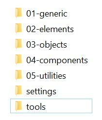
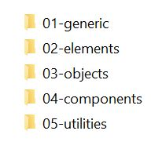
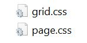
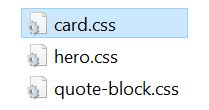

You may have come across the following recommendation when running your website through google page speed insights:

> Remove dead rules from stylesheets [...] to reduce unnecessary bytes consumed by network activity.

I am going to recommend a workflow for structuring and writing CSS and a way to produce dynamic CSS bundles that only load the CSS needed for each page in a Umbraco website.

For this blog article we will be:

1. Structuring the CSS using ITCSS
2. Utilizing BEM methodology to write CSS components
3. Using Gulp to compile SCSS to CSS
4. Using client dependency to only load CSS required for each page

<h2>Structuring the CSS using ITCSS</h2>

<a href="https://itcss.io/">ITCSS</a> (created by Harry Roberts) stands for inverted triangle CSS and helps you to organize your CSS into different layers depending on their specificity, it is comprised of the following:

1. <strong>Settings:</strong> Variables e.g. colours, fonts, sizing etc.
2. <strong>Tools:</strong> Mixins or functions.
3. <strong>Generic:</strong> Any global rules, normalizers/resets CSS (this is the first layer that produces CSS).
4. <strong>Elements:</strong> Basic styling for heading, paragraphs, links etc
5. <strong>Objects:</strong> Basic layout elements and frameworks to hold other components e.g. a grid framework. 
6. <strong>Components:</strong> Specific components within our project e.g. a quote block.
7. <strong>Utilities:</strong> Any global utility and helper methods e.g. hider class.

Typically, I end up with the following folder structure within a folder called SCSS (this is my preference for writing CSS), with the generic, elements, objects, components and utilities layers being numbered:



The reason I have not numbered setting and tools is because these two layers do not produce CSS by themselves (e.g. variables, mixins and functions), they will instead be imported into other sass files (via ```@import```) and utilized this way. The numbering of the layers will become useful later on when I am building our dynamic CSS and deciding which order they should go in.

<h2>Utilizing BEM methodology to write CSS components</h2>

BEM stands for block - element - modifier and provides a structure for writing our CSS, I have written about this in <a href="/blog/an-introduction-to-bem/">another blog article</a> therefore I won't go into too much detail, but in short I am going to write my name-spaced components like so:

```scss
@import 'settings/colours'

.quote-block {
    &__author {
        color: $primary;
    }
    &__quote {
        color: $primary;
        font-size: 1rem;
        &--large {
            font-size: 2rem;
        }
    }

}
```

(The above will be saved as a file called 'quote-block.scss' in the components folder)

<h2>Using Gulp to compile SCSS to CSS</h2>

I won't go over the <a href="https://gulpjs.com/docs/en/getting-started/quick-start/">initial gulp environment setup</a> as there are plenty of tutorials elsewhere, however for the purpose of this blog article we need to set up a task to compile our SCSS to CSS and output it to a folder:

```js
'use strict';

var gulp = require('gulp');
var sass = require('gulp-sass');

sass.compiler = require('node-sass');

gulp.task('sass', function () {
    return gulp.src('./scss/**/*.scss')
                .pipe(sass().on('error', sass.logError))
                .pipe(gulp.dest('./css'));
});

gulp.task('sass:watch', function () {
    gulp.watch('./scss/**/*.scss', ['sass']);
});
```

When I run this task my output folder (/css) looks like the following:



With each folder containing the outputted CSS for each file e.g.

<strong>Generic folder:</strong>


<strong>Objects folder:</strong>



<strong>Component folder:</strong>


<h2>Using client dependency to only load CSS required for each page</h2>

Now that we have individual CSS files being outputted the next step is to utilize client dependency to build up a dynamic CSS bundle. <a href="https://github.com/Shazwazza/ClientDependency">Client dependency</a> is a framework that allows you to build a dynamic CSS bundle based on CSS dependencies you have declared in your razor files.

For starters, let's create a master template (the top layer):

```html
@using ClientDependency.Core.Mvc
@using ClientDependency.Core
@{
    Html.RequiresCss("~/css/generic/normalizer.css", 1);
    Html.RequiresCss("~/css/generic/scaffolding.css", 1);
    Html.RequiresCss("~/css/elements/headings.css", 2);
    Html.RequiresCss("~/css/elements/lists.css", 2);
    Html.RequiresCss("~/css/elements/links.css", 2);
}
<html>
<head>
    @Html.RenderCssHere()
</head>
<body>
    @RenderBody()
</body>
```

1. Firstly, I am importing the name space client dependency into our view.
2. I am using the HTML method ```RenderCssHere``` to output the CSS bundle in the ```<head>``` section of our master template.
3. I am declaring a few CSS files (these are at the top of the triangle and are therefore more generic rules) to include as a dependency on the master template. Also, notice we are passing in a number as a second argument, this means these files are placed in this order in the outputted CSS bundle and directly maps to our ITCSS numbering.

Next up, let's create a content template that utilizes the master template:

```html
@using ClientDependency.Core.Mvc
@using ClientDependency.Core
@inherits Umbraco.Web.Mvc.UmbracoViewPage<ContentModels.ContentPage>
@{
    Layout = "Master.cshtml";
    Html.RequiresCss("~/css/objects/page.css", 3);
    Html.RequiresCss("~/css/objects/grid.css", 3);
}
<div class="page">
    @Html.Partial("Hero")
    <div class="grid">
        <div class="grid__col">
            @Html.Partial("SubNavigation")
        </div>
        <div class="grid__col">
            @Html.Partial("QuoteBlock")
        </div>
    </div>
</div>
```

I am including the CSS dependencies in the same way on the page template, however these CSS files are the next layer down in the ITCSS pyramid (e.g. page based styling in the objects layer). I have also rendered a couple of partials on this template, let's take a look at the quote block:

```html
@using ClientDependency.Core.Mvc
@using ClientDependency.Core
@inherits Umbraco.Web.Mvc.UmbracoViewPage<ContentModels.ContentPage>
@{
    Layout = "Master.cshtml";
    Html.RequiresCss("~/css/components/quote-block.css", 4);
}
<div class="quote-block">
    <div class="quote-block__quote">

    </div>
    <div class="quote-block__author">

    </div>
</div>
```

In this partial, I am declaring that we need the quote-block.css as a dependency. 

All in, I have built up dynamic CSS bundle by declaring the CSS needed in each layer of the website (Master template > Page templates > Partials). When the CSS bundle is produced it will only include the CSS required by each layer via the ```RequireCss``` calls. There are several other benefits including:

1. It will remove any duplicates e.g. if you had two quote block partials on one page it would not include the CSS for this component twice in your CSS bundle.
2. If a component is removed, so is the CSS dependency which in turns results in a smaller CSS bundle size.
3. In debug mode it will output individual CSS files (rather than one CSS bundle) to allow for easier debugging.
4. It minifies and bundles when in release mode.


<h2>Conclusion</h2>

We have combined ITCSS, BEM and client dependency to provide a workflow for building and maintaining our CSS in Umbraco, and in the long run reduced the amount of redundant CSS rules being loaded on each page. 


