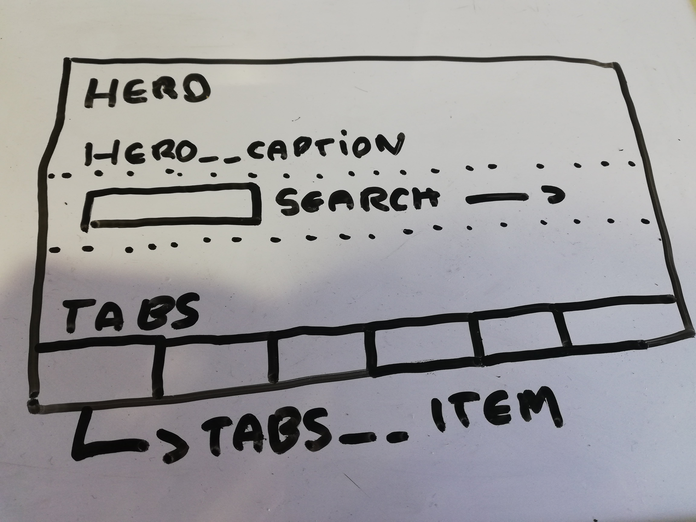

BEM has been around for a couple of years now, but even with the advent of CSS-in-JS solution and scoped CSS it is still my go-to for writing CSS. Before I go into detail on why I use BEM let's go over the basics.

BEM which stands for **Block**, **Element** and **Modifier** is a methodology for writing CSS in a scoped way. For the rest of the article I'm going to be using Sass, but this can all be equally applied to plain-old css too. 

<h2>Block</h2>

The way the scoping works in BEM is first by defining a block (you can also think of this as a component on a page) to start writing your CSS for, for this example let's start with a navigation:

```css
.navigation {
}
```

Pretty simple so far? This shouldn't be such a departure if you've written CSS before - the key takeaway at this stage being that you should break your page down into blocks of encapsulated CSS that you can apply to your HTML.

<h2>Element</h2>

If we were to think logically about the child elements in our navigation we would assume that there would be a list ```<ul>```, a list item ```<li>``` and a link ```<a>```. In BEM, these child  elements are defined using a double underscore between the block and element name and would be written like so in CSS:

```css
.navigation {
    &__list {
        display: flex;
        align-items: space-between;
    }
    &__item {
        flex: 1;
    }
    &__link {
        display: block;
        color: red;
    }
}
```

 If we were to compile this to CSS we would end up with the following CSS classes: ```.navigation__list```, ```.navigation__item``` and ```.navigation__link```. You can now see that we have clearly defined child elements that are scoped to the navigation block that we can apply to our HTML:

```html
<nav class="navigation">
    <ul class="navigation__list">
        <li class="navigation__item">
            <a class="navigation__link" href="">
            </a>
        </li>
    </ul>
</nav>

```

 <h2>Modifier</h2>

 There may be situations where you don't need a new element, but need to modify it somehow. In the case of a navigation you may need to indicate a active state - step in **modifiers**. A modifier is defined using a double dash between either the **block** or the **element**:

 ```css
.navigation {
    &--pad {
        padding: 20px;
    }
    &__link {
        display: block;
        color: red;
        &--is-active {
            border-bottom: 2px solid red;
        }
    }
}
```

The link class modifier will output as ```.navigation__link--is-active``` in your css and you  **add** it onto the ```.navigation__link``` class when you want to indicate a active link e.g. 
```html
<a class="navigation__link navigation__link--is-active" href="">
</a>
```
<h2>Why's it so great?</h2>

1. Shared language within the team - this means that it's easier for a fellow team member to pick up the component and understand what it's trying to achieve from the get-go.
2. No hugely sprawling SCSS files - preventing infinite amounts of nesting which can be hard to read and discern the purpose of each selector.
3. Use modifiers to create alternative versions of components - this encourages the re-use of the same component.
4. By following this methodology it scopes your CSS - this in turn reduces conflicts with other team member's CSS as well as your own.

<h2>What to watch out for...</h2>

1. Do not tie naming to particular content - think about the **purpose** of the component and name it based on this e.g. 'Grid List' rather than 'Event List'. This means this component makes sense in more than one context (even if it's only used in one to begin with).
2.  Try not to reach for modifiers straight away - think about how *flexbox* or *grid* can help achieve your layout aims.
3. The component should work in most contexts therefore leave layout and alignment to higher level components - in other words, the component should work in isolation.
4. Don't try and do too much with one component, if you are finding it increasingly difficult to  name the elements within the component it's likely a sign that you need to break it down into multiple components.

<h2>In practice...</h2>

You may come across a design like the below (hopefully it will look slightly better!):



In the above example I would separate the components like so:

- The hero would be the highest level component, with it's own child element ```.hero__caption``` (this could contain any content)
- The ```.hero__caption``` element would control the alignment of any child elements within it using flexbox, I would also add a few modifiers to align it to the left, center or right e.g. ```.hero__caption--align-right```.
- The search box would be a new component, it's alignment in this context would be controlled by the parent element.
- The tabs would be another new component, comprised of a ```.tab__item``` and ```.tab__link```.

As you can see with the above example I have split the design into three different components, not only this I have decoupled the components so that the search and tabs could be easily moved from this component and used elsewhere, equally another component could sit inside the hero caption.

<h2>Conclusion</h2>

BEM is great for making it easier to name your CSS and creating a shared language amongst team members, but above all it encourages you to break down your layouts into logical and purposeful components.


