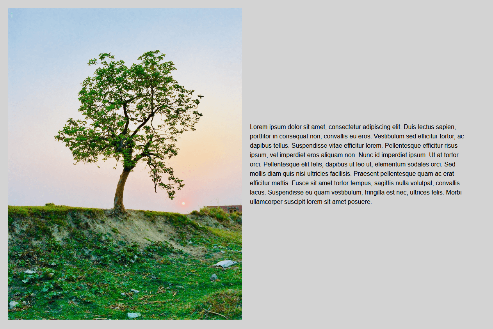
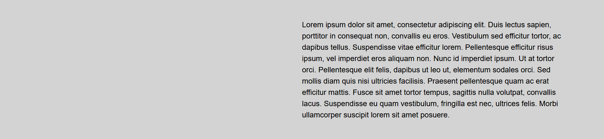
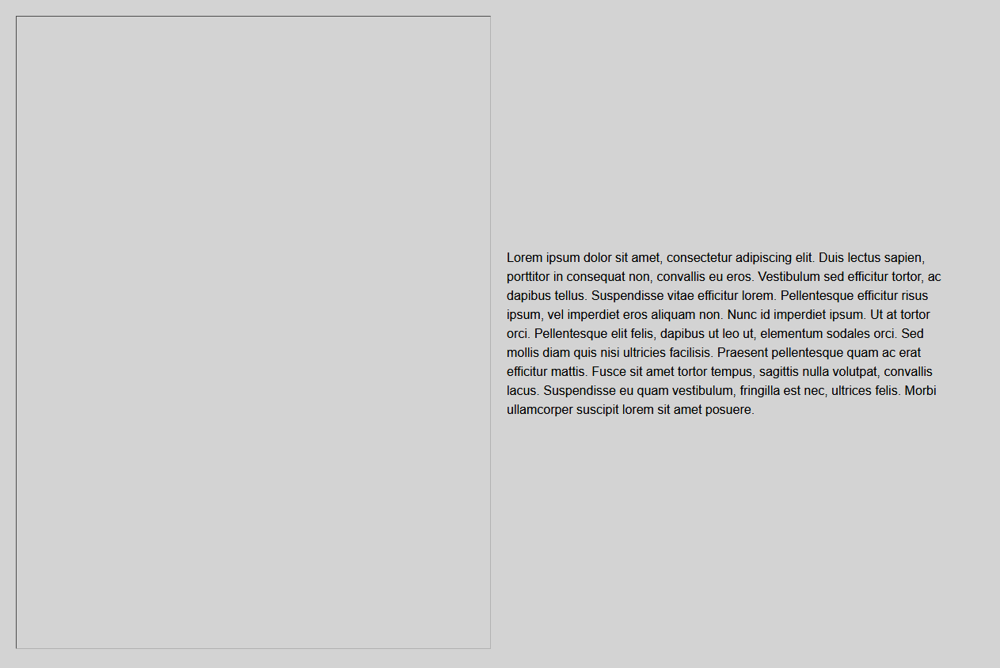

<h2>What is CLS?</h2>

CLS stands for cumulative layout shift, in short this is caused when a element is added or loaded and forces other visible elements on the page to shift. You may have noticed this when browsing web pages that use image lazy loading, as you scroll down images will load in as you need them, however these unloaded images do not take up any space on the page so when they load it causes other elements on the page to shift around. This leads to a poor user experience as the user may be moved around the page unexpectedly, additionally this is a key metric in google page speed scores.

<h2>Preventing CLS on variable height images</h2>

There are many common techniques for solving this such as the <a href="https://css-tricks.com/snippets/sass/maintain-aspect-ratio-mixin/">aspect ratio</a> trick that locks an image to a fixed aspect ratio using a combination of pseudo elements and object fit properties (there is a native property coming soon called ```aspect-ratio```). However, how is it best to handle a component that will accommodate images of different heights?

Take this component for example:



The image on the left will have a fixed width, however depending on what image is used it may have a different height (the component can accommodate both landscape and portrait images). I've set a width of 100% for the image as it will always fit to the left hand column width wise, and set the height to auto, this results in the image always proportionally (re)sizing to the container it's placed in. 

However, in our example the content is smaller in height than the image, therefore before the image has loaded it looks like this: 



The components overall height is drastically reduced meaning when the image loads (either on page load or via lazy loading) it will cause not only for the component to change in height but other elements on the page to move about. How do we prevent this issue? The simple solution to this is to add width and height attributes on the image tag and set the corresponding values to the dimensions of the image:

```html

```

You may think this will cause sizing issues as we are setting a explicit width and height attribute (especially as we resize the screen to different breakpoints) however the browser will calculate the space needed after any CSS rules are applied e.g. ```width: 100%; height: auto```. The result is that in the image in it's unloaded state will now take up space:



You can see the outline of the visible space reserved for the image by the browser, you could even set a background colour/placeholder here to indicate to the user that this space will be filled. 

Link to codepen: https://codepen.io/cjloff/pen/qBqMawa?editors=1100

<h2>Automating in Umbraco</h2>

It is possible to automate this process in Umbraco with the following razor code:

```razor

```

This code is broken down as follows:

1. We set the image width and height attributes to their original source dimensions of the image in the media library e.g. 1200 x 1800 using the ```umbracoWidth``` and ```umbracoHeight``` properties.
2. As we are using CSS to set the image width to 100% and height to auto the browser will effectively work out the space required for the image, even if the original source image dimensions exceeds the width of the container it's placed in. For example, if the image (with original dimensions of 1200px x 1800px) is placed in a container that has a width of 600px, the browser will work out that the effective space that needs to be reserved is 600px x 900px.
2. Use the ```GetCropUrl``` method (which utilizes <a href="https://imageprocessor.org/">.NET ImageProcessor</a> under the hood) and only set the width property to 600px, this will automatically set the height of the returned image to 900px. This will ensure that we load in an image with the correct dimensions and appropriate weight.

This is a simple technique that solves CLS issues on variable height images.


